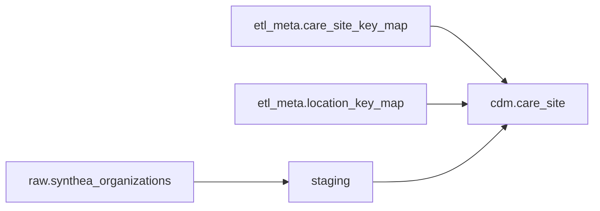

# Lineage: `care_site`

```mermaid
flowchart LR
  src0["raw.synthea_organizations"] --> stg0["staging"]
  km_etl_meta_care_site_key_map["etl_meta.care_site_key_map"] --> tgt["cdm.care_site"]
  km_etl_meta_location_key_map["etl_meta.location_key_map"] --> tgt["cdm.care_site"]
  stg0 --> tgt["cdm.care_site"]
```
