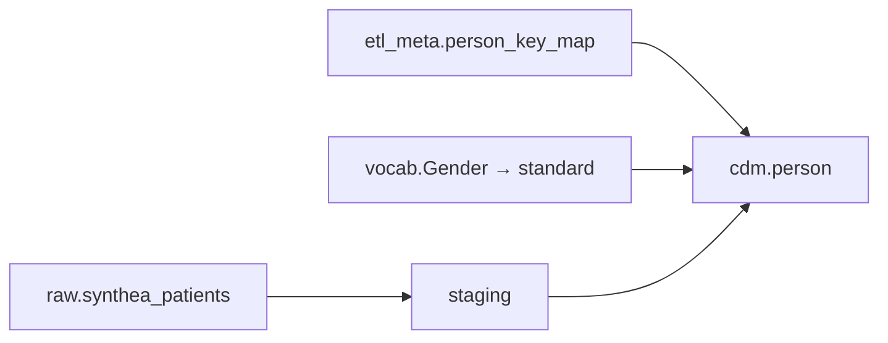

# Lineage: `person`

```mermaid
flowchart LR
  src0["raw.synthea_patients"] --> stg0["staging"]
  km_etl_meta_person_key_map["etl_meta.person_key_map"] --> tgt["cdm.person"]
  std_gender["vocab.Gender → standard"] --> tgt["cdm.person"]
  stg0 --> tgt["cdm.person"]
```
