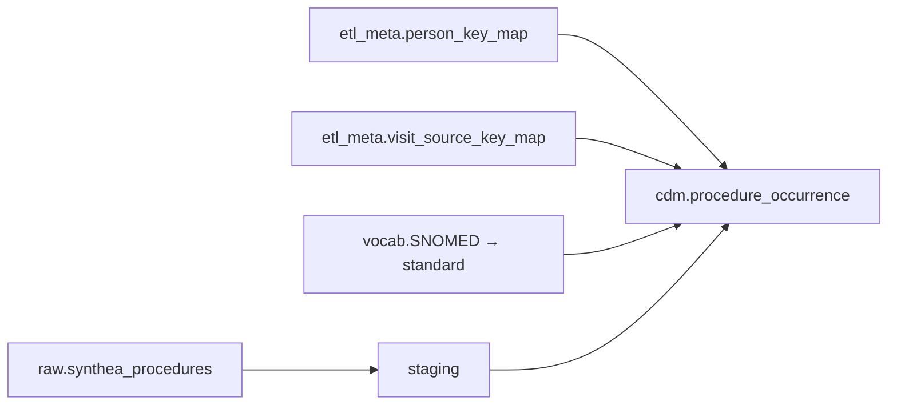

# Lineage: `procedure_occurrence`

```mermaid
flowchart LR
  src0["raw.synthea_procedures"] --> stg0["staging"]
  km_etl_meta_person_key_map["etl_meta.person_key_map"] --> tgt["cdm.procedure_occurrence"]
  km_etl_meta_visit_source_key_map["etl_meta.visit_source_key_map"] --> tgt["cdm.procedure_occurrence"]
  std_snomed["vocab.SNOMED → standard"] --> tgt["cdm.procedure_occurrence"]
  stg0 --> tgt["cdm.procedure_occurrence"]
```
