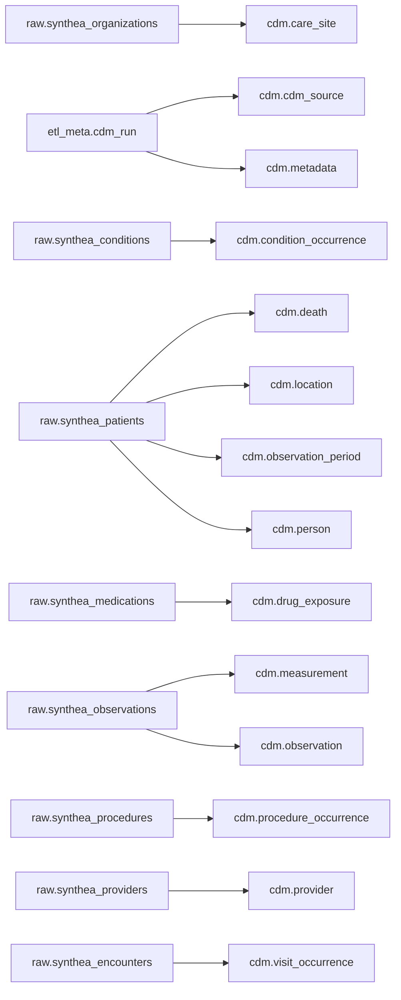

# Whole-project lineage

```mermaid
flowchart LR
  s_raw_synthea_organizations["raw.synthea_organizations"]
  s_raw_synthea_organizations --> t_care_site["cdm.care_site"]
  s_etl_meta_cdm_run["etl_meta.cdm_run"]
  s_etl_meta_cdm_run --> t_cdm_source["cdm.cdm_source"]
  s_raw_synthea_conditions["raw.synthea_conditions"]
  s_raw_synthea_conditions --> t_condition_occurrence["cdm.condition_occurrence"]
  s_raw_synthea_patients["raw.synthea_patients"]
  s_raw_synthea_patients --> t_death["cdm.death"]
  s_raw_synthea_medications["raw.synthea_medications"]
  s_raw_synthea_medications --> t_drug_exposure["cdm.drug_exposure"]
  s_raw_synthea_patients --> t_location["cdm.location"]
  s_raw_synthea_observations["raw.synthea_observations"]
  s_raw_synthea_observations --> t_measurement["cdm.measurement"]
  s_etl_meta_cdm_run --> t_metadata["cdm.metadata"]
  s_raw_synthea_observations --> t_observation["cdm.observation"]
  s_raw_synthea_patients --> t_observation_period["cdm.observation_period"]
  s_raw_synthea_patients --> t_person["cdm.person"]
  s_raw_synthea_procedures["raw.synthea_procedures"]
  s_raw_synthea_procedures --> t_procedure_occurrence["cdm.procedure_occurrence"]
  s_raw_synthea_providers["raw.synthea_providers"]
  s_raw_synthea_providers --> t_provider["cdm.provider"]
  s_raw_synthea_encounters["raw.synthea_encounters"]
  s_raw_synthea_encounters --> t_visit_occurrence["cdm.visit_occurrence"]
```
