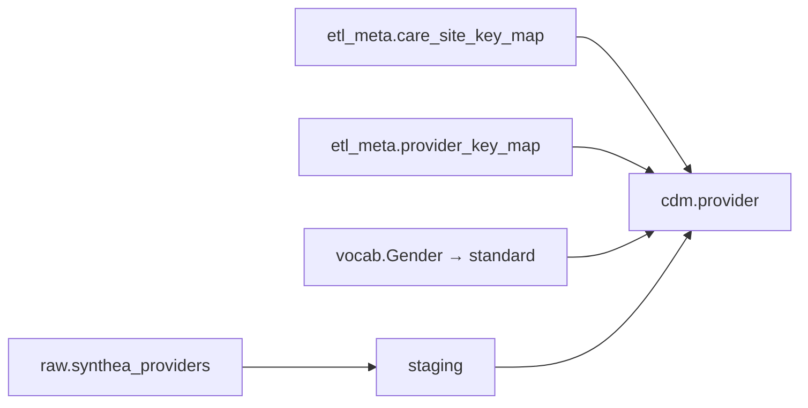

# Lineage: `provider`

```mermaid
flowchart LR
  src0["raw.synthea_providers"] --> stg0["staging"]
  km_etl_meta_care_site_key_map["etl_meta.care_site_key_map"] --> tgt["cdm.provider"]
  km_etl_meta_provider_key_map["etl_meta.provider_key_map"] --> tgt["cdm.provider"]
  std_gender["vocab.Gender → standard"] --> tgt["cdm.provider"]
  stg0 --> tgt["cdm.provider"]
```
