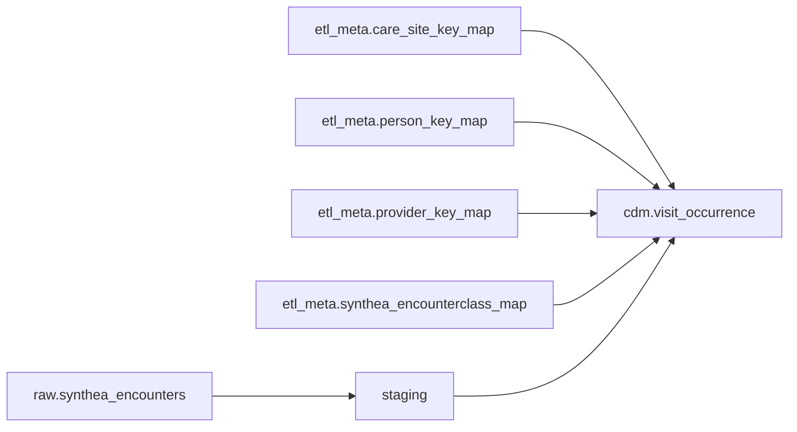

# Lineage: `visit_occurrence`

```mermaid
flowchart LR
  src0["raw.synthea_encounters"] --> stg0["staging"]
  km_etl_meta_care_site_key_map["etl_meta.care_site_key_map"] --> tgt["cdm.visit_occurrence"]
  km_etl_meta_person_key_map["etl_meta.person_key_map"] --> tgt["cdm.visit_occurrence"]
  km_etl_meta_provider_key_map["etl_meta.provider_key_map"] --> tgt["cdm.visit_occurrence"]
  km_etl_meta_synthea_encounterclass_map["etl_meta.synthea_encounterclass_map"] --> tgt["cdm.visit_occurrence"]
  stg0 --> tgt["cdm.visit_occurrence"]
```
